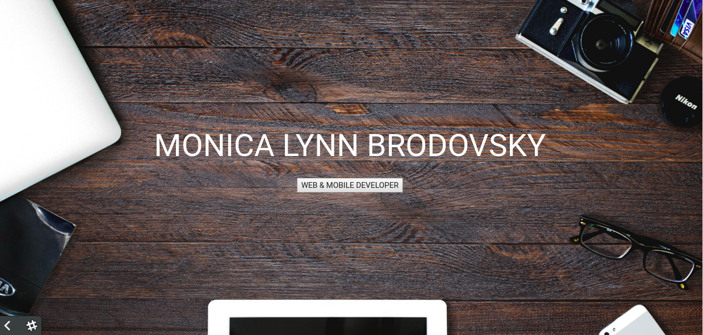
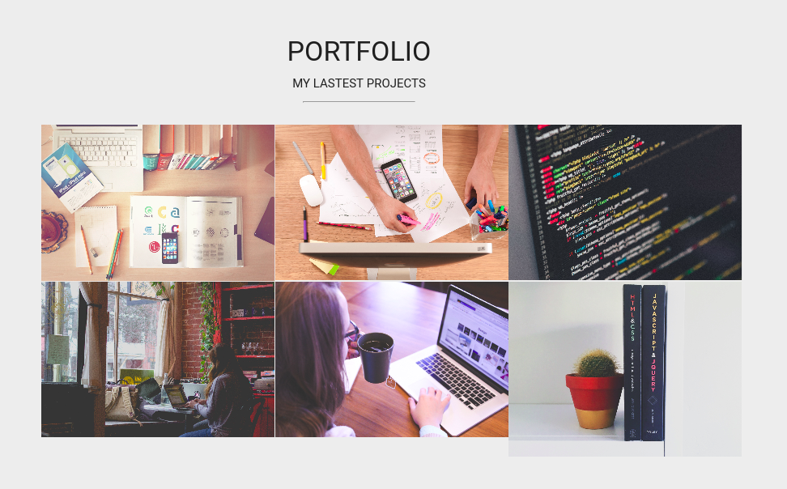

# Portfolio con Materialize

###### Proyecto grupal Sprint3/Lección35 - Bootcamp Laboratoria

Crear una web-portafolio utilizando las clases del framework **_Materialize_**

### La web

----------------------------------------------------------------------------------
## Team

 |  | 
|---|---|---|
[Annia J. Flores](https://github.com/itsandromeda) | [Luz Gutierrez](https://github.com/mili01gm) | [Ariana Cabana](https://github.com/arianacabana09)

Mira cómo quedó haciendo click [aquí](https://mili01gm.github.io/portfolio-materialize/).
